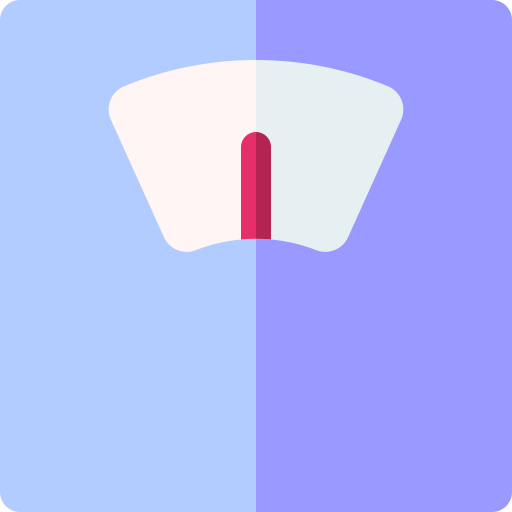
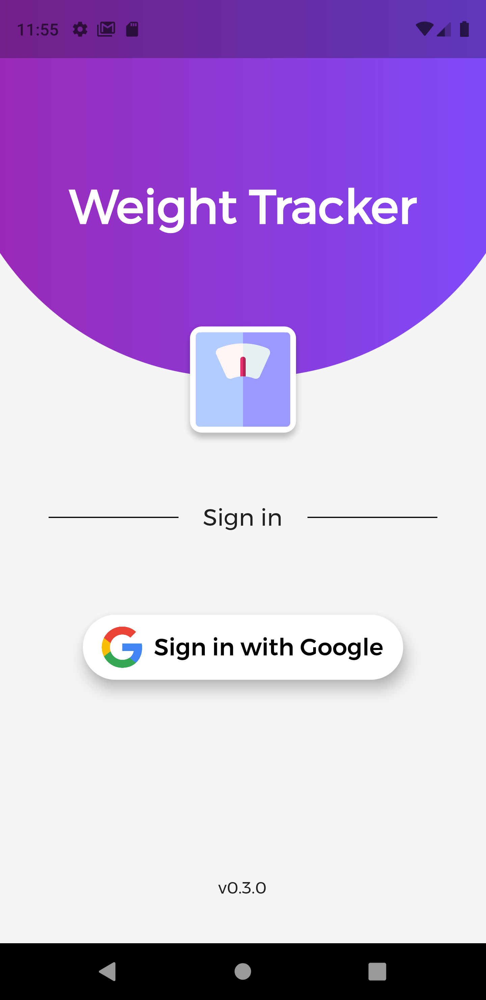
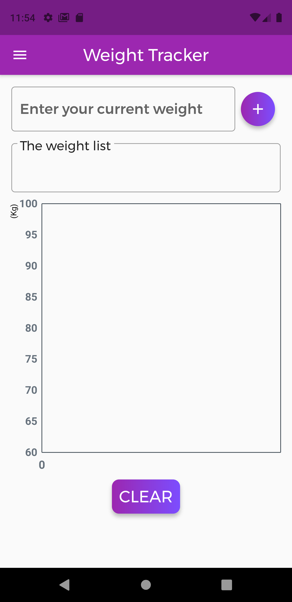
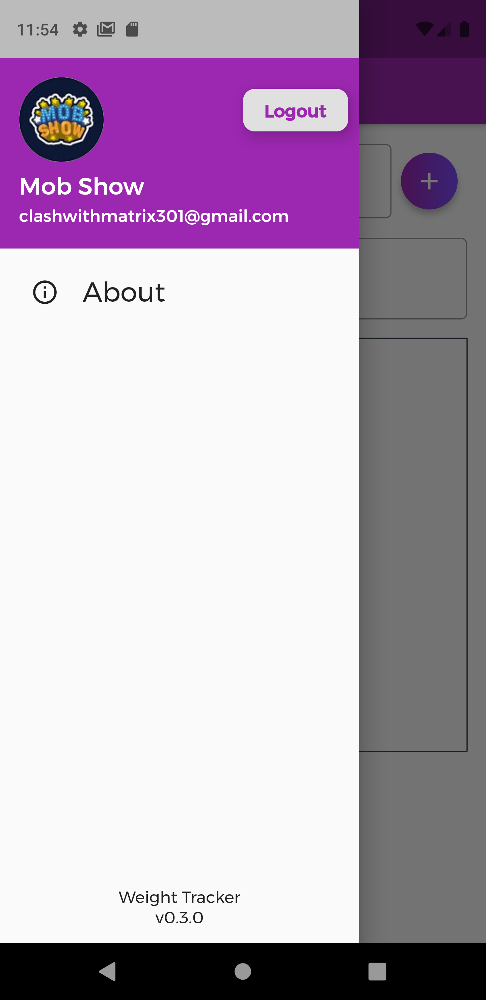

# Weight Tracker - V0.3.0

This is a Weight tracking application developed using Flutter with Firebase as backend. Google sign in available and separate user profiles present for separate accounts.

## Screenshots:

  
  
  

## Packages Used:
* <a href="https://pub.dev/packages/fl_chart">FL Chart</a> for representing the weight data graphically
* <a href="https://pub.dev/packages/cloud_firestore">Cloud Firestore</a> - Firebase Firestore used as DB
* <a href="https://pub.dev/packages/google_sign_in">Google sign in</a> - Sign in with Google
* <a href="https://pub.dev/packages/flutter_launcher_icons">Flutter Launcher Icons</a> for adding the app icon
* <a href="https://pub.dev/packages/firebase_auth">Firebase Auth</a> - Firebase Authentication
* <a href="https://pub.dev/packages/google_fonts">Google Fonts</a> - For using he google font family - Montserrat
