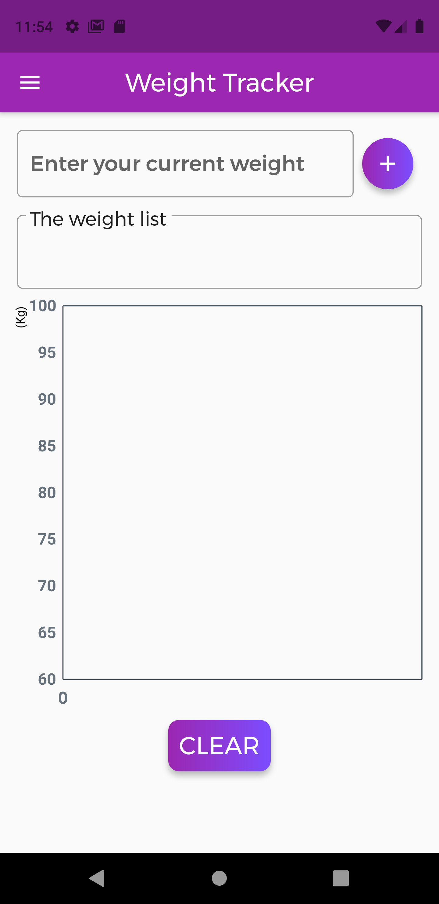

# Log
Weight Tracker v0.3.0 - This is a continuation to the [old repo](https://github.com/deepakmkoshy/WeightTracker). v0.3.0 completely replaces the backend from Hive to Firebase. For checking the old log updates checkout the log.md file of old repo.

### 28-12-2020:

After going through the official docs, I was able to implement firestore as the backend for this app. Even though everything still looks the same, the backend is firebase now. Next planned update is to implement google sign in, so that each user can have their own separate tracker. 

### 29-12-2020

Finally implemented Google sign in. Also updated the code so that each user gets their own document in firestore.

Already logged in users will go directly to homepage(skipping login screen).

Learned that for signing out a user, both Firestore instance and Google sign in instance have to be logged out. Had to spent quite a some time to figure this out.

Added logos, launcher icon, splash screen, changed app name.

The main homepage is now messy, as I added user display name and signout button for debugging. Have to fix that by adding sidebar and moving user details there. 

### 07-01-2020

The project is complete for now. Moved the user details to drawer and added a neat logout button there. Changed font to montserrat. 

Added an awesome login page. Modified the minor UI details to look more presentable. Refactored the code.

Screenshots:

  
  
  
  

## ToDo

* Add more features like BMI calculator etc(by using 3rd party API's)- Maybe create my own API for learning purpose in future
* Back button on homepage shouldn't pop to login screen

## Done

* Implemented Google sign in
* Update the sidebar to include the logged in user details
* Fix routing- Tried but couldn't do it
